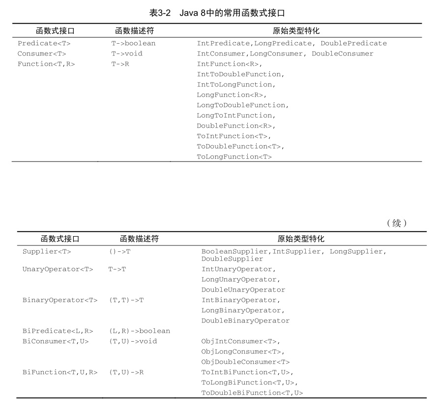

# Java 8 知识点梳理



## 1. Function<T, R>   T -> R

### 常见需求：模板方法的简化

```java
 	/**
     * 20:26:52.660 [main] INFO cn.com.java8example.Example - 论文名称是：论文1
     * 20:26:52.725 [main] INFO cn.com.java8example.Example - 论文内容是：这是一篇论文
     * 20:26:52.730 [main] INFO cn.com.java8example.Example - 论文作者是：Example.Student(name=李四, age=16, gender=BOY, height=185, role=NORMAL)
     * 20:26:52.730 [main] INFO cn.com.java8example.Example - 论文名称是：论文2
     * 20:26:52.730 [main] INFO cn.com.java8example.Example - 论文内容是：这是一篇论文2
     * 20:26:52.733 [main] INFO cn.com.java8example.Example - 论文作者是：Example.Student(name=阿大, age=17, gender=BOY, height=176, role=MONITOR)
     *
     */
    @Test
    public void testFunction() {
        // 模板方法 由客户端自己决定需要什么样的学生
        // 找一个最高的学生
        writePaper("论文1", "这是一篇论文", getHighStudent);
        // 随机一个
        writePaper("论文2", "这是一篇论文2", randomSelect);
    }

    /**
     * function 模板方法， 当然模板方法也可以用别的类如{@link Consumer} and {@link Supplier}
     *
     * 编写论文
     *
     * @param paperName 名称
     * @param paperContent 内容
     * @param pickStudent 如何选择学生
     */
    private void writePaper(String paperName,
                            String paperContent,
                            Function<List<Student>, Student> pickStudent) {
        log.info("论文名称是：{}", paperName);
        log.info("论文内容是：{}", paperContent);
        // 我们假设 我们需要选择不同的学生来编写论文 可以由客户端自己决定 采取某种算法
        
        // java7中我们则需要，创建一个接口，然后实现不同的子类，然后方法中参数是该接口
        // 每次我们都要进行接口的实现，即便使用匿名内部类那也会写的很冗长
        log.info("论文作者是：{}", pickStudent.apply(students));
    }
```

### QQT中模板方法的使用

需求概述：由于数据集和仪表盘数据库设计和对应的类都是不同的人设计的，在创建者和修改者字段命名的时候未统一，导致它们的get和set方法都是不一样的（本质都是一样的），故就有了下面的这段代码。`Function`和`BiConsumer`

```java
/**
     * 获得pageDTO对象
     * 将pageDTO中的列表中的trueId的值转化为名称
     *
     * @param pageInfo    pageInfo 对象
     * @param getCreator  获得创建者
     * @param getModifier 获得修改者
     * @param setCreator  赋值创建者
     * @param setModifier 赋值修改者
     * @param <T>         pageInfo中的值
     * @return 转化为自己的pageDTO对象
     */
    protected <T> PageDTO<T> getPageDTO(PageInfo<T> pageInfo,
                                        Function<T, String> getCreator,
                                        Function<T, String> getModifier,
                                        BiConsumer<T, String> setCreator,
                                        BiConsumer<T, String> setModifier) {
        List<T> targetList = pageInfo.getList();
        if (CollectionUtils.isEmpty(targetList)) {
            return PageDTO.noData(pageInfo.getPageNum());
        }
        convertTrueIdToUsername(targetList, getCreator, getModifier, setCreator, 
                                setModifier);
        return new PageDTO<>(targetList, pageInfo.getTotal(), pageInfo.getPageNum());
    }

  /**
     * 将用户trueId转化为用户名
     *
     * @param targetList  目标列表
     * @param getCreator  获得创建者
     * @param getModifier 获得修改者
     * @param setCreator  赋值创建者
     * @param setModifier 赋值修改者
     * @param <T>         目标列表中的值
     */
    private <T> void convertTrueIdToUsername(List<T> targetList,
                                             Function<T, String> getCreator,
                                             Function<T, String> getModifier,
                                             BiConsumer<T, String> setCreator,
                                             BiConsumer<T, String> setModifier) {
        List<String> trueIdList = collectAllTrueId(targetList, getCreator, getModifier);
        if (CollectionUtils.isEmpty(trueIdList)) {
            return;
        }
        UserNameAdaptor userNameAdaptor = staffComponent.getUserNameAdaptor(trueIdList);
        targetList.forEach(targetInfo -> {
            setCreator.accept(targetInfo, 
                              userNameAdaptor.getUserName(getCreator.apply(targetInfo)));
            setModifier.accept(targetInfo, 
                             userNameAdaptor.getUserName(getModifier.apply(targetInfo)));
        });
    }
```

### `Function`中的`compose` 和`andThen`

```java
 	 /**
     * 执行顺序 f2: substring => f1: replace => f3: toLowerCase
     * 18:42:22.911 [main] INFO cn.com.java8example.Example - substring, str:GO AFTER ALL AMBULANCES
     * 18:42:22.921 [main] INFO cn.com.java8example.Example - replace, str:AFTER ALL AMBULANCES
     * 18:42:22.921 [main] INFO cn.com.java8example.Example - toLowerCase, str:_FTER _LL _MBUL_NCES
     * @see Function#compose(Function) <code>
     *     default <V> Function<V, R> compose(Function<? super V, ? extends T> before) {
     *         Objects.requireNonNull(before);
     *         return (V v) -> apply(before.apply(v));
     *     }
     *     </>
     * @see Function#andThen(Function) 
     * @see Function#compose(Function) 
     */
    @Test
    public void testFunctionOfComposeAndThen() {
//         compose and andThen
        Function<String, String> f1 = s -> {
            log.info("replace, str:{}", s);
            return s.replace('A', '_');
        };
        Function<String, String> f2 = s -> {
            log.info("substring, str:{}", s);
            return s.substring(3);
        };
        Function<String, String> f3 = s -> {
            log.info("toLowerCase, str:{}", s);
            return s.toLowerCase();
        };
        // 结果是什么？
        // 对CompletableFuture中的thenCompose是不会一样 先执行后者 在执行前者呢？
        Function<String, String> f4 = f1.compose(f2).andThen(f3);

        f4.apply("GO AFTER ALL AMBULANCES");

    }
```

### `compose`源码

```java
/**
     * Returns a composed function that first applies the {@code before}
     * function to its input, and then applies this function to the result.
     * If evaluation of either function throws an exception, it is relayed to
     * the caller of the composed function.
     *
     * @param <V> the type of input to the {@code before} function, and to the
     *           composed function
     * @param before the function to apply before this function is applied
     * @return a composed function that first applies the {@code before}
     * function and then applies this function
     * @throws NullPointerException if before is null
     *
     * @see #andThen(Function)
     */
    default <V> Function<V, R> compose(Function<? super V, ? extends T> before) {
        Objects.requireNonNull(before);
        return (V v) -> apply(before.apply(v));
    }
```


## 2.Consumer\<T> T -> void

### `peek()` VS `foreach()`

需求：从数据库获得学生数据 and 从数据库中获得学生对应的课程信息 ->  转化为学生DTO对象 -> 添加学生课程信息 -> 收集为列表

```java
 	/**
     * T -> void
     *
     * @see java.util.function.Consumer#andThen(Consumer)
     * @see java.util.function.Consumer#accept(Object)
     * @see Stream#forEach(Consumer) 循环 属于终止操作
     * @see Stream#peek(Consumer) 查看一个 属于中间操作 返回一个 Stream
     * @see java.util.stream.Collectors#groupingBy(Function)
     * @see java.util.stream.Collectors#groupingBy(Function, Collector)
     * @see java.util.stream.Collectors#groupingBy(Function, Supplier, Collector)
     */
    @Test
    public void testConsumer() {
        // 最简单的 foreach 进行打印操作
        this.students.forEach(System.out::println);

        // peek操作
        // 需求：
        // 1.我们从数据库中查询得到student列表
        // 2.我们从数据库中分别获得学生对应的课程信息
        List<String> studentNameList = 
            	this.students.stream().map(Student::getName).collect(toList());
        // 课程列表
        List<Course> courseList = listCourseFromDatabase(studentNameList);
        // 转化为map 获得最大效率 toMap和 groupingBy的区别？
        Map<String, List<Course>> studentCourseMap = 
            	courseList.stream().collect(groupingBy(Course::getStudentName));
        // 获得学生列表的信息
        Consumer<StudentDTO> setStudentCourses = studentDTO -> {
            // getOrDefault 添加默认值
            List<Course> courses = studentCourseMap.getOrDefault(studentDTO.getName(), 
                                                                 new ArrayList<>());
            studentDTO.setCourses(courses);
        };

        // 3.然后我们用stream中的peek方法进行组装
        List<StudentDTO> studentDTOList = this.students.stream()
                .map(StudentDTO::convert)
                .peek(setStudentCourses)
                .sorted(Comparator.comparingInt(StudentDTO::getAge))
                .collect(toList());
    }
```

## 3.Predicate\<T> T -> boolean

谓词，本质就是boolean的判断，比较简单，多在stream的filter中使用

```java
  	/**
     * 可以随意组合不同的条件 取反 逻辑或 逻辑与
     *
     * @see Predicate#and(Predicate)
     * @see Predicate#negate()
     * @see Predicate#or(Predicate)
     * @see Stream#filter(Predicate)
     * @see java.util.Collection#removeIf(Predicate) java8新方法，满足条件才进行删除
     */
    @Test
    public void testPredicate() {
        Predicate<Student> normalStudent = stu -> Role.NORMAL.equals(stu.getRole());
        Predicate<Student> highStudent = stu -> MAX_HEIGHT.equals(stu.getHeight());

        // 获得高的和角色是普通的学生
        List<Student> normalAndHighStudent = this.students.stream()
                .filter(normalStudent.and(highStudent))
                .collect(toList());

        // 假设我们要删除不满足条件的学生
        boolean result = this.students.removeIf(stu -> stu.getAge() < 17);
    }
```

## 4.Supplier\<T>  () -> T

```java
    /**
     * 生产者，从无到有的一个过程
     * 
     * @see ThreadLocal#withInitial(Supplier) 为每个线程都添加一个学生
     * @see CompletableFuture#supplyAsync(Supplier) 创建非阻塞线程的工厂方法
     */
    @Test
    public void testSupplier() {
        AtomicLong taskNumSupplier = new AtomicLong(0);
        // CompletableFuture 非阻塞Future
        CompletableFuture.supplyAsync(() ->createTask(taskNumSupplier.getAndIncrement()))
                .whenComplete((data, error) -> log.info("任务-{}执行结束", data, error));

        // ThreadLocal创建 我们为每一个线程 都添加了个学生 让他可以利用学生来进行某些操作
        // 而不用 每个线程每次操作都去创建一个学生
        ThreadLocal<Student> studentThreadLocal = 
            		ThreadLocal.withInitial(Example::randomStudent);
        log.info("当前学生：{}", studentThreadLocal.get());
    }
```

## 5.Stream\<T>

### 1.map filter sort peek flatMap等

```java
	/**
     * 从列表中获得流 然后进行 map filter sort peek flatMap 等操作
     *
     */
    @Test
    public void testStreamFunction() {
        // 从列表中获得流 然后进行 map filter sort peek flatMap 等操作
        List<String> stringByteList = Arrays.stream("java8 zheng niubi~!".split(" "))
                .flatMapToInt(CharSequence::chars)
                .skip(2)
                .filter(i -> i > 2)
                .limit(10)
                .boxed()
                .map(i -> i + "byte")
                .collect(toList());

        // java8
        new Random(47)
                .ints(5, 20)
                .distinct()
                .limit(7)
                .sorted()
                .forEach(System.out::println);
        // java7
        Random rand = new Random(47);
        SortedSet<Integer> rints = new TreeSet<>();
        while(rints.size() < 7) {
            int r = rand.nextInt(20);
            if(r < 5) continue;
            rints.add(r);
        }
        System.out.println(rints);
    }
```

### 2.流的创建（延迟加载）

```java
	/**
     * 流的创建
     *
     * @see Stream#iterate(Object, UnaryOperator)
     * @see Stream#generate(Supplier)
     * @see Stream#of(Object)
     * @see Stream#concat(Stream, Stream) 
     * @see IntStream#rangeClosed(int, int)
     * @see IntStream#range(int, int) 
     *
     */
    @Test
    public void testStreamCreated() {
        LocalDate today = LocalDate.now();
        IntUnaryOperator minusMonths = monthsToSubtract -> 	
            today.minusMonths(monthsToSubtract)
                .getMonth()
                .getValue();

        // rangeClosed 代替 fori 这种循环
        Stream<String> recentMonth = IntStream.rangeClosed(1, 3)
                .map(minusMonths)
                .boxed()
                .map(month -> month + "月");

        Stream<String> commonTitle = Stream.of("工具", "应用情况");
        // 延迟加载 只有遇到collect的时候才进行计算
        List<String> titleList = Stream.concat(commonTitle, 
                                               recentMonth).collect(toList());

        // Stream.generate 创建同一对象的流  Supplier
        Stream.generate(() -> 1)
                .limit(3)
                .forEach(System.out::println);

        // Stream.iterate step 步长 流 (seed, T -> T)
        Stream.iterate(0, n -> n + 2)
                .limit(10)
                .forEach(System.out::println);
    }
```

### anyMatch  noneMatch allMatch短路操作

```java
	/**
     * 都是短路操作 一旦匹配那就会终止 就比如 && 和 || 的短路作用一样  
     * 
     * @see Stream#anyMatch(Predicate)
     * @see Stream#noneMatch(Predicate)
     * @see Stream#allMatch(Predicate) 
     *
     */
    @Test
    public void testStreamTerminal() {
        // anyMatch  noneMatch 短路操作
        //1 2 3 4 5 6 7 8 9 true
        //1 2 3 4 false
        //1 true
        //1 2 3 4 5 6 7 8 9 false
        //1 false
        //1 2 3 4 5 6 7 8 9 true

        show(Stream::allMatch, 10);
        show(Stream::allMatch, 4);
        show(Stream::anyMatch, 2);
        show(Stream::anyMatch, 0);
        show(Stream::noneMatch, 5);
        show(Stream::noneMatch, 0);
    }
```

### 收集操作

```java
	/**
     * 收集器
     *
     */
    @Test
    public void testStreamCollectors() {
        // 收集操作
        // toList toMap groupingBy toArray joining
        Map<String, Student> putIfAbsentMap = this.students.stream()
                .collect(toMap(Student::getName, 
                               Function.identity(), 
                               (prev, next) -> next));
        // groupingBy
        // toMap和 groupingBy的区别？
        Map<String, List<Course>> studentCourseMap = 
            	courseList.stream().collect(groupingBy(Course::getStudentName));
        
        // toArray()
        Student[] students = this.students.stream().toArray(Student[]::new);
        
        // StringJoiner java8以后
        // 一般我们都是 new一个StringJoiner类 然后呢add进去
        // 用这个我们可以将两行 变成一行
        String nameString = 
            	this.students.stream().map(Student::getName).collect(joining(","));
    }
```


## 6.Optional\<T>

```java
  	/**
     * 避免空值在程序中传输造成的空指针
     * 比如读取cookie的值，根据企业ID在数据库中查询基本信息，这些都是可能返回空的
     * 这玩意可以最大程度避免一些无谓的if判断
     * 注意这个只能区别null，不能区别空列表如<code>[]</code>
     *
     * @see Optional#orElse(Object)
     * @see Optional#orElseGet(Supplier) 懒加载
     * @see Optional#orElseThrow(Supplier)
     * @see Optional#ofNullable(Object) 可以为空
     * @see Optional#of(Object) 不能为空 空就throw空指针
     * @see Optional#empty() 就是个空 对null的包装
     * @see Optional#ifPresent(Consumer) java8下只有Consumer的操作 <br>
     * @see <a href="https://docs.oracle.com/en/java/javase/12/docs/api/java.base/java/util/Optional.html#ifPresentOrElse(java.util.function.Consumer,java.lang.Runnable)">
     *     java12中添加了<code>ifPresentOrElse​(Consumer<? super T> action, Runnable emptyAction)
     *     </a>
     */
    @Test
    public void testOptional() {
        Optional<Student> studentOptional = findStudent("阿大");
        // 和流一样 可以进行map filter flatMap
        Integer studentHeight = studentOptional.map(Student::getHeight)
                .filter(height -> height > 180)
                // java12 中默认 orElseThrow()抛出该异常
                .orElseThrow(NoSuchElementException::new);

        // 不一样的地方 ifPresent orElseGet orElse orElseThrow
        studentOptional.ifPresent(System.out::println);

        // 利用 Supplier 来实现 懒加载 这也是和 orElse的区别
        Student theStudentByLazy = studentOptional.orElseGet(Student::getMaster);
        // 即便不为空 Student.getMaster()也会执行 这不是我们要的效果
        Student theStudentByEager = studentOptional.orElse(Student.getMaster());
    }
```

## 7.Map 中的新方法

```java
   /**
     * 19:45:51.914 [main] INFO cn.com.java8example.Example - 男女的身高分布，{GIRL=[165], BOY=[176, 173, 185, 175, 174]}
     * 19:45:51.937 [main] INFO cn.com.java8example.Example - genderHeightMapByToMap：{GIRL=[165], BOY=[176, 173, 185, 175, 174]}
     * 19:45:51.942 [main] INFO cn.com.java8example.Example - 学生按照角色来统计分布：{NORMAL=6}
     * 19:45:51.943 [main] INFO cn.com.java8example.Example - 是否含有阿9：{
     *                      李四=Example.Student(name=李四, age=16, gender=BOY, height=185, role=NORMAL), 
     *                      张三=Example.Student(name=张三, age=18, gender=BOY, height=173, role=NORMAL), 
     *                      王五=Example.Student(name=王五, age=17, gender=BOY, height=175, role=NORMAL), 
     *                      阿9=Example.Student(name=阿9, age=null, gender=null, height=null, role=null), 
     *                      赵六=Example.Student(name=赵六, age=18, gender=GIRL, height=165, role=NORMAL), 
     *                      阿大=Example.Student(name=阿大, age=17, gender=BOY, height=176, role=MONITOR), 
     *                      朱七=Example.Student(name=朱七, age=19, gender=BOY, height=174, role=NORMAL)
     * }
     * 
     * @see Map#compute(Object, BiFunction)
     * @see Map#computeIfAbsent(Object, Function)
     * @see Map#computeIfPresent(Object, BiFunction)
     * @see Map#putIfAbsent(Object, Object)
     * @see Map#getOrDefault(Object, Object)
     * @see Map#forEach(BiConsumer)
     * @see Map#merge(Object, Object, BiFunction)
     */
    @Test
    public void testMapNewFunction() {
        Map<String, Student> studentMap = new HashMap<>();

        //getOrDefault
        Student studentOrMaster = studentMap.getOrDefault("阿大", Student.getMaster());
```
### 1.compute
```java
        // compute 为空 那么新加一个名为"阿大"的学生，有那么就改变它的角色
        Student newStudnet = studentMap.compute("阿大", (key, value) -> {
            if (value == null) {
                return new Student("阿大");
            } else {
                value.setRole(Role.NORMAL);
                return value;
            }
        });
```
### 2.computeIfAbsent
```java
        // computeIfAbsent 十分有用的一个方法
        // 假设现在需要统计男女的高度
        // java7 我们则需要判断value是不是为空 为空那么就新建一个list 然后put进去 然后list.add()
        Map<Gender, List<Integer>> genderHeightMap = new HashMap<>();
        for (Student student : this.students) {
            // 新的结果
            List<Integer> heightList = genderHeightMap
                    .computeIfAbsent(student.getGender(), (gender) -> new ArrayList<>());
            heightList.add(student.getHeight());
        }

        log.info("男女的身高分布，{}", genderHeightMap);

        // 奇怪的写法 toMap() 不是我们想要的
        final Map<Gender, List<Integer>> genderHeightMapByToMap = this.students.stream()
                .collect(toMap(Student::getGender, stu -> {
                    List<Integer> list = new ArrayList<>();
                    Integer height = stu.getHeight();
                    list.add(height);
                    return list;
                }, (prev, next) -> {
                    prev.addAll(next);
                    return prev;
                }));

        log.info("genderHeightMapByToMap：{}", genderHeightMapByToMap);
```
### 3.computeIfPresent
```java
        // computeIfPresent 统计某一个年龄段的学生个数
        Map<Role, Integer> roleStudentMap = new HashMap<>();
        roleStudentMap.put(Role.NORMAL, 1);
        for (Student student : this.students) {
            roleStudentMap.computeIfPresent(student.getRole(), 
                                           	(key, value) -> value + 1);
        }

        log.info("学生按照角色来统计分布：{}",roleStudentMap);
```
### 4.putIfAbsent
```java
        // putIfAbsent
        Map<String, Student> putIfAbsentMap = this.students.stream()
                .collect(toMap(Student::getName, Function.identity(), (prev, next) -> next));
        putIfAbsentMap.putIfAbsent("阿9", new Student("阿9"));

        log.info("是否含有阿9：{}", putIfAbsentMap);

    }
```

