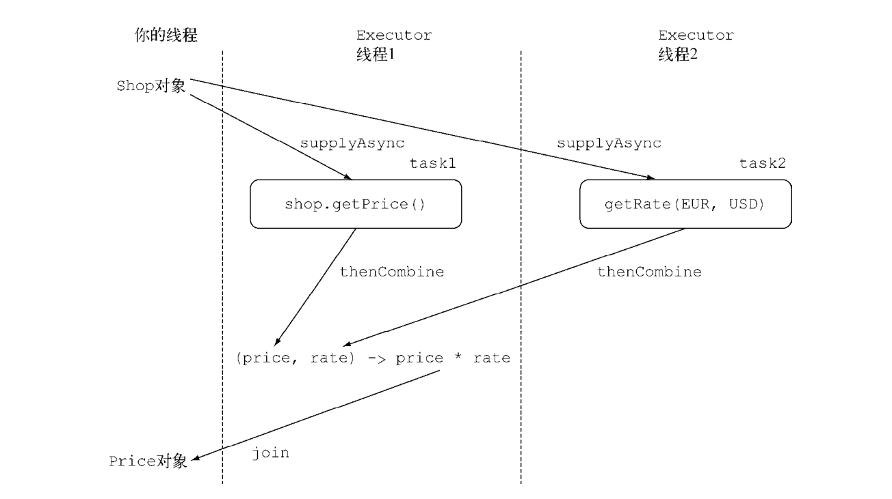
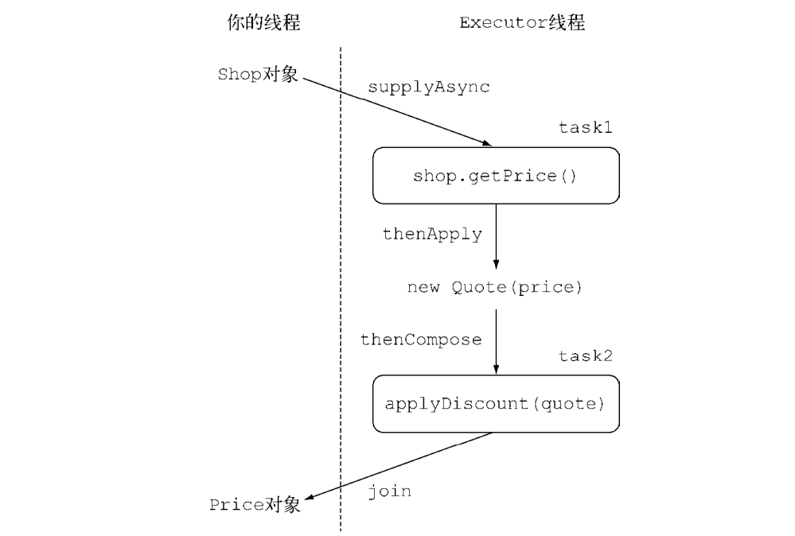

# java8-in-action
java8-in-action
#### 1.ForkJoin的框架的实现
```
if (任务足够小或不可分) {
    顺序计算该任务
} else {
    将任务分成两个子任务
    递归调用本方法，拆分每个子任务，等待所有子任务完成
    合并每个子任务的结果
}
```
- 具体代码的实现
```
int length = end - start;
if (length <= THRESHOLD) {
    return computeSequentially();
}
ForkJoinSumCalculator leftTask =
    new ForkJoinSumCalculator(numbers, start, start + length/2);
leftTask.fork();
ForkJoinSumCalculator rightTask =
    new ForkJoinSumCalculator(numbers, start + length/2, end);
Long rightResult = rightTask.compute();
Long leftResult = leftTask.join();
return leftResult + rightResult;
```
- 一种错误的方式
    + 这样会操成有线程变成了监工，不工作，分的越多，情况
    越明显
```
leftTask.fork();
rightTask.fork();

Long leftResult = leftTask.join();
Long rightResult = rightTask.join();
```

#### Supplier 供应商 生产者
```java
@FunctionalInterface
public interface Supplier<T> {

    /**
     * Gets a result.
     *
     * @return a result
     */
    T get();
}
```
- 例子
```
public void log(Level level, Suppiler<String> msgSupplier){
    if(logger.isLoggable(level){
        log(level, msgSupplier.get());
    }
}
```
- 思考
    + 用这种方式的时候，一帮都是在需要胖丁第一个参数的
    状态，然后才操作第二个参数。
    + 所以一般遇到这种情况的时候，可以新建一个方法来避免这种
    显示的判断.
#### java8 与 策略模式
- 避免了 样板代码（很好）
```java

public interface ValidationStrategy {
    boolean execute(String s);
}

public class Validator{
    private final ValidationStrategy strategy;
    
    public Validator(ValidationStrategy v){
        this.strategy = v;
    }
    public boolean validate(String s){
        return strategy.execute(s);
    }
}

public class Main{
    public static void main(String[] args){
      //java8
      Validator numericValidator =
          new Validator((String s) -> s.matches("[a-z]+"));
      boolean b1 = numericValidator.validate("aaaa");
      Validator lowerCaseValidator =
          new Validator((String s) -> s.matches("\\d+"));
      boolean b2 = lowerCaseValidator.validate("bbbb");
    }
}
```
#### java8中Consumer接口思考 模板方法
```
public void processCustomer(int id, Consumer<Customer> makeCustomerHappy){
    Customer c = Database.getCustomerWithId(id);
    makeCustomerHappy.accept(c);
}

new OnlineBankingLambda().processCustomer(1337, (Customer c) ->
    System.out.println("Hello " + c.getName());
```
> 这样不用继承一个接口 然后 写他的实现类。java8可以直接通过lambda进行操作

#### CompletableFuture思考
- thenCompose()
```java

/**
 * 将两个异步操作合并 然后进行某些操作
 * @see CompletableFuture#thenCombine(CompletionStage, BiFunction)
 *
 * @param product
 * @return
 */
public List<String> findPricesInUSD(String product) {
    List<CompletableFuture<String>> priceFutures = SHOPS.stream()
            .map(shop -> CompletableFuture.supplyAsync(() -> shop.getPrice(product))
                    .thenCombine(CompletableFuture
                                    .supplyAsync(() -> ExchangeService.getRate(ExchangeService.Money.EUR, ExchangeService.Money.USD)),
                            (price, rate) -> price * rate)
                    .thenApply(price -> shop.getName() + " price is " + price))
            .collect(toList());
    return priceFutures.stream()
            .map(CompletableFuture::join)
            .collect(toList());
}
```


- thenApply and thenCombine
```java
/**
 * 使用异步任务进行获得future
 *
 * 名称中不带 Async
 * 的方法和它的前一个任务一样，在同一个线程中运行；而名称以 Async 结尾的方法会将后续的任
 * 务提交到一个线程池，所以每个任务是由不同的线程处理的。
 *
 * @param product 商品
 * @return 异步任务进行获得future
 */
public List<String> findPriceByCompletedFutureMore(String product) {
    List<CompletableFuture<String>> pricesFutures = SHOPS.stream()
            .map(shop -> CompletableFuture.supplyAsync(() -> shop.getAndFormatPrice(product), priceExecutorService))
            // 因为它没有io操作 是cpu密集 所以直接thenApply操作
            .map(future -> future.thenApply(Quote::parse))
            // applyDiscount 是比较耗时的操作 所以需要开启异步进行
            // compose 将两个异步操作进行流水线操作 如 第一个操作完成时，将其结果作为参数传递给第二个操作。
            .map(future -> future.thenCompose(quote ->
                    CompletableFuture.supplyAsync(() -> Discount.applyDiscount(quote), priceExecutorService)))
            .collect(toList());
    return pricesFutures.stream().map(CompletableFuture::join).collect(toList());
}
```
